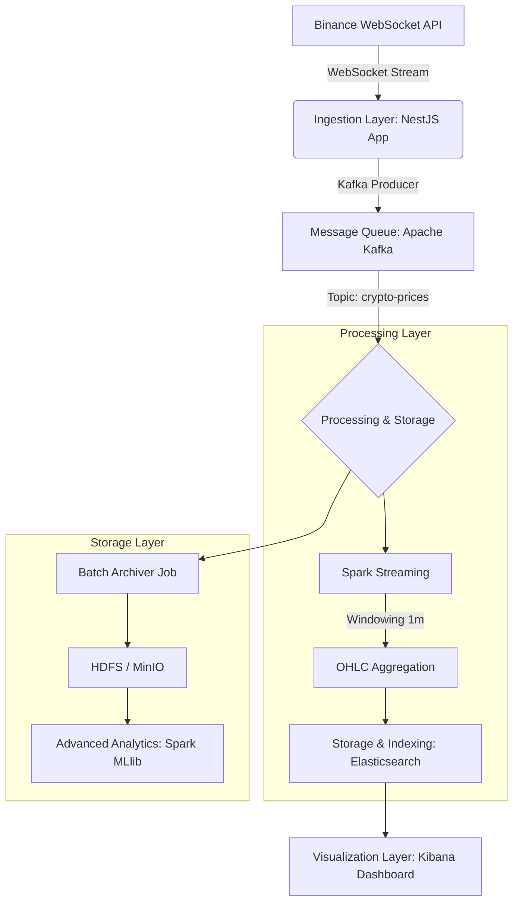

# Project Instructions (GEMINI.md)

This file contains the foundational mandates for all agents working on the IT4931 Big Data project. Adhere strictly to these architectural patterns, technical standards, and reporting requirements.

## I. System Architecture



---

## II. Tech Stack & Environment

- **Ingestion:** NestJS (binance-ingest)
- **Messaging:** Apache Kafka
- **Processing:** Apache Spark (Structured Streaming, MLlib)
- **Storage:** HDFS, MinIO, Elasticsearch
- **Visualization:** Kibana
- **Orchestration:** Docker Compose (Development), Kubernetes (Production Target)

---

## III. Agent Mandates (Workbook)

### 1. Spark Structured Streaming Standards
When providing PySpark/Scala code, you MUST implement:
- **Windowing & Watermarking:** 1-minute sliding/tumbling window (`window(col("timestamp"), "1 minute")`) with a 10-second watermark (`.withWatermark("timestamp", "10 seconds")`).
- **OHLC Aggregation:** Use `first()`, `max()`, `min()`, `last()` for Open, High, Low, Close.
- **Fault Tolerance:** Always configure `checkpointLocation` on HDFS/MinIO. Use `outputMode("update")` or `append`.

### 2. Performance Optimization Guidance
Do not provide generic advice. Guide users to:
- **Broadcast Join:** For joining real-time streams with small metadata tables.
- **Persistence:** Use `.persist(StorageLevel.MEMORY_AND_DISK)` for branching streams.
- **Partitioning:** Tune `spark.sql.shuffle.partitions` based on K8s cluster cores (avoid default 200).

### 3. Kubernetes Transition
Proactively guide the migration from Docker Compose to K8s:
- Use **Deployments** for stateless apps and **StatefulSets** for Kafka, ES, and Redis.
- Manage configuration via **ConfigMaps** and **Secrets**.
- Ensure data persistence using **PersistentVolumeClaims (PVC)**.

---

## IV. Mandatory Reporting Standards (Lessons Learned)

Agents must enforce this 4-part structure for all technical lessons learned.

### Standard Lesson Template
```markdown
### Bài học X: [Technical Title]

#### Mô tả vấn đề
- **Bối cảnh:** System state and configuration.
- **Thách thức:** Specific error/bottleneck (OOM, data loss, etc.).
- **Tác động:** Failure details (latency, accuracy, downtime).

#### Cách tiếp cận đã thử
- **Cách 1:** Initial solution + trade-offs/failure reason.
- **Cách 2:** Improved solution (if applicable).

#### Giải pháp cuối cùng
- **Chi tiết:** Final code, config, or algorithm.
- **Triển khai:** Implementation steps on Spark/Kafka/K8s.
- **Kết quả:** Quantifiable metrics (e.g., "latency reduced from 5s to 100ms").

#### Điểm rút ra
- **Hiểu biết:** Technical root cause.
- **Best Practices:** Rules for future projects.
- **Đề xuất:** Scaling strategy (e.g., 10x growth).
```

### Lesson Categories & Guidance
1. **Data Ingestion:** Connection resilience (Exponential Backoff), deduplication (UUID/timestamp).
2. **Spark Processing:** OOM prevention, memory tuning, `reduceByKey` vs `groupByKey`.
3. **Streaming:** Handling late data via Watermarking.
4. **Data Storage:** Write optimization (Bulk Indexing), Parquet for long-term storage.
5. **System Integration:** Startup ordering (K8s initContainers), Circuit Breakers.
6. **Performance Tuning:** Data Skew mitigation (Salting).
7. **Monitoring:** Kafka Lag metrics, Prometheus/Grafana, Spark UI.
8. **Scaling:** HPA (Horizontal Pod Autoscaler), Partition scaling.
9. **Data Quality:** Validation filters for anomalous data.
10. **Security:** SASL/PLAIN for Kafka, X-Pack/Secrets for Elasticsearch.
11. **Fault Tolerance:** Replication factors, Checkpointing.
